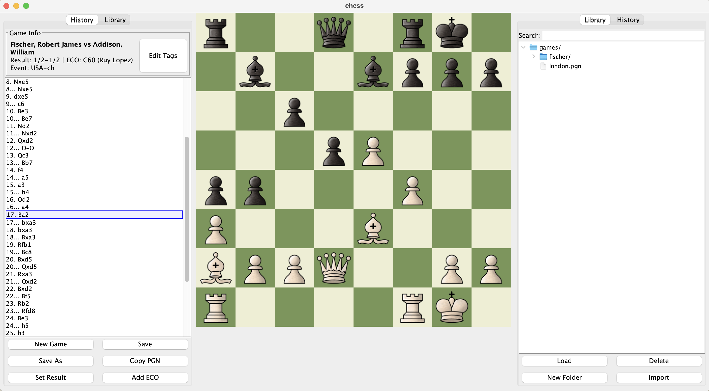

## for storing my repetoire and analyzing my chess games

*Basic Desired features:*
- [x] Display a single-player chess game
- [x] Provide tracking of moves
- [x] Provide tree-structure to track different possible move orderings and variation
- [x] Provide per-move/turn comments/annotations
- [x] Provide the option to save current board and all variations to a pgn file that can be loaded back and used within chess websites.
- [x] Provide option to load board pgn to analyze game.
- [x] Directory-based game library organization - Create folders within the games directory to organize PGN files

*More advanced features:*
- [ ] Provide evaluation bar with stockfish
- [ ] Provide best move view with stockfish
- [ ] Provide arrows and square highlighting
- [ ] Provide custom themes

### Controller
- GameNode that represents the current board state that is in view.
    - We don't want to just have a ChessGame field because we don't want each chess game to have to keep track of a position that the view should be looking at within itself.
        - It seems like a chess game should just represent a chess game object, not all of the other business with which point of the game we are viewing or playing at.
- GameLibrary
    - On creation, all the games from our `games/` directory are loaded and stored in a map.
    - We can access stored games via this field, and also save new games to our library via this field.
- View
    - Our main frame view that stores our board panel view and side panel view
    - It also holds onto the tile size that we are going to use for the chess board
- selectedSquare, currentDragPoint, draggedPiece
    - These are all relevent to how the controller decides what happens once a piece is selected, dragged, placed, etc.

### Model

Piece
- We assume that every piece that is created, is on the board, or on _a_ board.
    - String name: "White Pawn", "Black Knight", maybe also with abbreviations: "wp" "wn", etc
    - Enum Type: piece type for easy and fast checks
    - color: white(T) or black(F) boolean
    - points: the worth of the piece
        - Pawns: 1
        - Rooks: 5
        - Knights/Bishops: 3
        - Queens: 9
        - King: INF
    - Row/Column Position on whatever board it is on

Move:
- Used to denote the changes between board states/positions.
    - Piece that was moved
    - Row/Column start position to end position
    - Algebraic notation of the move to store in the history
        - Because we are using the moves as start position and end position data, we don't need to care if this notation denotes an _ambiguous_ move such as R3e2, or Nbd5.
    - The move _types_, whether it is a short castle, capture, capture with check, promotion with checkmate, etc.
        - Thus, a single move can have multiple move _types_.

GameNode
- This is a board state/position that has child nodes that represent the different possible variations that have been recorded from this move on.
    - Parent Node to represent the state/position that we came from
    - The move that brought us to this position.
        - For the root node where there is no move that came before it, it will have a null move.
    - The other GameNode children that represent subsequent variations
    - Annotations for this game position
    - Board state methods that were inherited and overriden

ChessGame
- This is the data structure that is used to create a single new chess game. It starts the tree of GameNodes that hold all subsequent variations.
    - A list of GameNodes that are our first moves.
        - Initially, the list will always be empty because no moves will have been made, though when a move is made, it is added as the root node, and first node of this new variation.
    - Map of tags, that represent the header tags within a chess pgn save.
        - This is mostly important only for when we import games from lichess or chessdotcom that have metadata, though maybe I will add an option to add metadata when saving games from the application.

GameLibrary
- On creation, all `.pgn` games within the `games/` path are loaded and stored in a hierarchical tree structure.
- The library now supports creating directories within the `games/` folder to organize PGN files. The interface displays a tree view showing folders and files.
- The pgns will all be in standard algebraic notation. While SAN is much easier, where it is (startCoordinate endCoordinate), without any other data such as `+` for check or `#` for checkmate, I want this to be compatible with lichess and chessdotcom pgns, and they use algebraic, so I will use algebraic.
- Because the algebraic is less straightforward to load from, I have to use the ChessGame public interface to find valid moves, through the parsed move that I find from the notation.
- Parsing will be challenging because I can't make a Move object without a `start` and `end` location, but with algebraic, we only get the `end` location and are left to deduce what the start location must have been from, based on the last known state of the board.
    - Holds path to games library.
    - Map from saved game path to ChessGame objects that are filled.
    - Tree structure with GameLibraryNode objects representing directories and files.

GameLibraryNode
- Represents a node in the game library file tree.
- Can be either a directory or a PGN file.
- Contains metadata about the file/directory including name, full path, and whether it's a directory.
- For PGN files, stores the associated ChessGame object.
- Provides methods for tree traversal and display formatting.

BoardState
- Immutable class used to represent board state/position data
- It is immutable because each ChessNode will have a BoardState, thus when a new node is created, we will simply use a producer within BoardState to copy it with the new move/change updated.
    - initializes the board state
    - Has its own verifier that can give information about options that each player has in terms of moving pieces and winning and losing, etc.
    - Keeps track of if the white/black kings have moved and thus lost their castling rights
    - Keeps track of an enPassantTarget, where it is only non-null when the last move made was a pawn double forward move.

ChessVerifier
- This has a board state object, and has a bunch of methods that show the possible valid moves that each player can make.
- Shows all the pieces that can reach a given square.
- Shows all the squares a given piece can go.
- Checks for legal moves, checks, checkmates, etc.

ImmutXY
- Simply an immutable int-pair that I use for the board coordinates.
- Much easier for return values when I want to return a row and column.
- Y is row, and X is column

